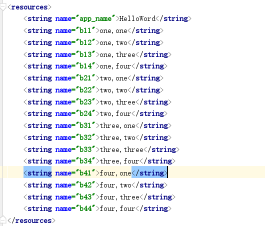

# Android界面布局

### 学习官方文档：

https://developer.android.google.cn/guide/topics/ui/declaring-layout.html

### 1.利用线性布局实现如下界面：


##### 1.可以通过改变每个linearlayout中的weight，可以调整布局内view的比例。

##### 2.可以把width/height修改成0dp，可以使view填充剩余空间。

#### 先在colors.xml中添加黑色：


#### string.xml：



#### linear_layout.xml：

```
<?xml version="1.0" encoding="utf-8"?>
<LinearLayout xmlns:android="http://schemas.android.com/apk/res/android"    android:layout_width="match_parent"    
android:layout_height="match_parent"   
android:background="@color/colorBlack"   
android:orientation="vertical">    
<LinearLayout        
android:layout_width="match_parent"       
android:layout_height="wrap_content">       
<Button          
android:layout_width="wrap_content"          
android:layout_height="wrap_content"            
android:id="@+id/btn1"            
android:text="@string/b11"/>        
<Button android:layout_width="wrap_content"            android:layout_height="wrap_content"           
android:id="@+id/btn2"            
android:layout_weight="1"           
android:text="@string/b12"/>       
<Button           
android:layout_width="wrap_content"           
android:layout_height="wrap_content"           
android:id="@+id/btn3"           
android:text="@string/b13"/>    
<Button    
android:layout_width="wrap_content"        
android:layout_height="wrap_content"     
android:id="@+id/btn4"        
android:text="@string/b14"/></LinearLayout>  
<LinearLayout        
android:layout_width="match_parent"      
android:layout_height="wrap_content">    
<Button            
android:layout_width="wrap_content"        
android:layout_height="wrap_content"       
android:id="@id/btn1"          
android:text="@string/b21"/>      
<Button           
android:layout_width="0dp"           
android:layout_height="wrap_content"  
android:id="@id/btn2"           
android:layout_weight="1"         
android:text="@string/b22"/>     
<Button            
android:layout_width="wrap_content"    
android:layout_height="wrap_content"      
android:id="@id/btn3"           
android:text="@string/b23"/>       
<Button          
android:layout_width="wrap_content"        
android:layout_height="wrap_content"         
android:id="@id/btn4"           
android:text="@string/b24"/>  
</LinearLayout>   
<LinearLayout     
android:layout_width="match_parent"      
android:layout_height="wrap_content">   
<Button           
android:layout_width="wrap_content"        
android:layout_height="wrap_content"       
android:layout_weight="1"         
android:id="@id/btn1"          
android:text="@string/b31"/>    
<Button           
android:layout_width="wrap_content"          
android:layout_height="wrap_content"         
android:id="@id/btn2"            
android:layout_weight="1"         
android:text="@string/b32"/>      
<Button            
android:layout_width="wrap_content"          
android:layout_height="wrap_content"    
android:layout_weight="1"            
android:id="@id/btn3"          
android:text="@string/b33"/>       
<Button    
android:layout_width="wrap_content" 
android:layout_height="wrap_content"      
android:layout_weight="1"           
android:id="@id/btn4"           
android:text="@string/b34"/>   
</LinearLayout>    <LinearLayout     
android:layout_width="match_parent"   
android:layout_height="wrap_content">   
<Button          
android:layout_width="wrap_content"       
android:layout_height="wrap_content"      
android:id="@id/btn1"          
android:text="@string/b41"/>       
<Button           
android:layout_width="wrap_content"        
android:layout_height="wrap_content"         
android:id="@id/btn2"          
android:layout_weight="1"           
android:text="@string/b42"/>       
<Button           
android:layout_width="wrap_content"  
android:layout_height="wrap_content"        
android:id="@id/btn3"          
android:text="@string/b43"/>       
<Button          
android:layout_width="wrap_content"  
android:layout_height="wrap_content"  
android:id="@id/btn4"           
android:text="@string/b44"/>    
</LinearLayout>   
</LinearLayout>
```


#### 结果：


### 2.利用ConstraintLayout实现如下界面：


##### 1.TextView中的gravity设置为center，文字内容居中。

##### 2.如果想要每行文字对齐可以设置*layout*_*constraintBaseline*_to*Baseline*Of 属性。

#### 先在colors.xml中添加颜色：


#### constraint_layout.xml：

```
<?xml version="1.0" encoding="utf-8"?>
<androidx.constraintlayout.widget.ConstraintLayout xmlns:android="http://schemas.android.com/apk/res/android"
xmlns:app="http://schemas.android.com/apk/res-auto"` 
android:layout_width="match_parent"
android:layout_height="match_parent"
android:background="@color/colorBlack">
<TextView
android:id="@+id/textView1"
android:layout_width="80dp"
android:layout_height="55dp"
android:background="@color/colorRed"
android:text="Red"
android:gravity="center"
android:textColor="@color/colorBlack"
app:layout_constraintStart_toStartOf="parent"
app:layout_constraintTop_toTopOf="parent"/>
<TextView
    android:layout_width="90dp"
    android:layout_height="55dp"
    android:id="@+id/textView2"
    android:text="ORANGE"
    android:textColor="@color/colorBlack"
    android:gravity="center"
    android:background="@android:color/holo_orange_dark"
    app:layout_constraintEnd_toEndOf="parent"
    app:layout_constraintStart_toStartOf="parent"
    app:layout_constraintTop_toTopOf="parent"
    />
<TextView
    android:layout_width="90dp"
    android:layout_height="55dp"
    android:id="@+id/textView3"
    android:text="YELLOW"
    android:textColor="@color/colorBlack"
    android:gravity="center"
    android:background="@color/colorYellow"
    app:layout_constraintTop_toTopOf="parent"
    app:layout_constraintEnd_toEndOf="parent" />
<TextView
    android:layout_width="55dp"
    android:layout_height="55dp"
    android:id="@+id/textView5"
    android:text="BLUE"
    android:textColor="@color/colorBlack"
    android:gravity="center"
    android:background="@android:color/holo_blue_light"
    app:layout_constraintTop_toTopOf="parent"
    app:layout_constraintEnd_toEndOf="parent"
    app:layout_constraintStart_toStartOf="parent"
    app:layout_constraintBottom_toBottomOf="parent"/>
<TextView
    android:layout_width="90dp"
    android:layout_height="55dp"
    android:id="@+id/textView4"
    android:text="GREEN"
    android:textColor="@color/colorBlack"
    android:gravity="center"
    android:background="@color/colorGreen"
    app:layout_constraintTop_toTopOf="parent"
    app:layout_constraintEnd_toStartOf="@id/textView5"
    android:layout_marginEnd="20dp"
    android:layout_marginStart="20dp"
    app:layout_constraintBottom_toBottomOf="parent"/>
<TextView
    android:layout_width="90dp"
    android:layout_height="55dp"
    android:id="@+id/textView6"
    android:text="INDIGO"
    android:textColor="@color/colorBlack"
    android:gravity="center"
    android:background="@color/colorIndigo"
    app:layout_constraintTop_toTopOf="parent"
    app:layout_constraintStart_toEndOf="@id/textView5"
    android:layout_marginEnd="20dp"
    android:layout_marginStart="20dp"
    app:layout_constraintBottom_toBottomOf="parent"/>

<TextView
    android:layout_width="match_parent"
    android:layout_height="55dp"
    android:text="VIOLET"
    android:textColor="@color/colorBlack"
    android:background="@color/colorViolet"
    android:gravity="center"
    app:layout_constraintBottom_toBottomOf="parent"/>
```

#### 结果：


### 3.利用表格布局实现如下界面：


##### 1.第一列只有“ ”和“×”，而且占比很小。

##### 2.第二列和第三列的weight都设置为1：1，才会足够大

##### 3.第三列控件中的gravity设置为right，文字实现右边对齐。

#### table_layout：

```
<?xml version="1.0" encoding="utf-8"?>
<TableLayout xmlns:android="http://schemas.android.com/apk/res/android"
    xmlns:tools="http://schemas.android.com/tools"
    android:layout_width="match_parent" android:layout_height="match_parent"
    android:background="@android:color/background_dark"
    android:shrinkColumns="0"
    >
    <View android:id="@+id/top"
        android:layout_width="match_parent"
        android:layout_height="1dp"
        android:background="@color/colorgreen"
        ></View>
    <TableRow>
        <TextView
            android:id="@+id/text"
            android:text="@string/blank"
            android:textColor="@color/colorGray" />
        <TextView
            android:id="@+id/text12"
            android:gravity="left"
            android:layout_weight="1"
            android:text="@string/open"
            android:textColor="@color/colorGray" />
<TextView
        android:id="@+id/text13"
        android:gravity="right"
        android:layout_weight="1"
        android:text="@string/ctrl_o"
        android:textColor="@color/colorGray" />
</TableRow>
<TableRow>
    <TextView
        android:id="@id/text"
        android:text="@string/blank"
        android:textColor="@color/colorGray" />
    <TextView
        android:id="@+id/text22"
        android:gravity="left"
        android:layout_weight="1"
        android:text="@string/save"
        android:textColor="@color/colorGray" />

    <TextView
        android:id="@+id/text"
        android:layout_weight="1"
        android:gravity="right"
        android:text="@string/ctrl_s"
        android:textColor="@color/colorGray"
        tools:ignore="DuplicateIds" />
</TableRow>
<TableRow>
    <TextView
        android:id="@id/text"
        android:text="@string/blank"
        android:textColor="@color/colorGray" />
    <TextView
        android:id="@+id/text32"
        android:gravity="left"
        android:layout_weight="1"
        android:text="@string/save_as"
        android:textColor="@color/colorGray" />

    <TextView
        android:id="@id/text33"
        android:layout_weight="1"
        android:gravity="right"
        android:text="@string/ctrl_shift_s"
        android:textColor="@color/colorGray"
        />
</TableRow>

<View android:id="@+id/line"
    android:layout_width="match_parent"
    android:layout_height="1dp"
    android:background="@color/colorgreen"
    ></View>

<TableRow>
    <TextView
        android:id="@id/text"
        android:text="@string/x"
        android:textColor="@color/colorGray" />
    <TextView
        android:id="@id/text41"
        android:layout_weight="1"
        android:text="@string/imports"
        android:textColor="@color/colorGray" />
        </TableRow>
<TableRow>
    <TextView
        android:id="@id/text"
        android:text="@string/x"
        android:textColor="@color/colorGray" />
    <TextView
        android:id="@+id/text52"
        android:layout_weight="1"
        android:text="@string/emport"
        android:textColor="@color/colorGray" />

    <TextView
        android:id="@+id/text53"
        android:layout_weight="1"
        android:gravity="right"
        android:text="@string/ctrl_e"
        android:textColor="@color/colorGray"
        />
</TableRow>
<View android:id="@id/line"
    android:layout_width="match_parent"
    android:layout_height="1dp"
    android:background="@color/colorgreen"
    />

<TableRow>
    <TextView
        android:id="@id/text"
        android:text="@string/blank"
        android:textColor="@color/colorGray" />
    <TextView
        android:id="@+id/text6"
        android:layout_weight="1"
        android:text="@string/quit"
        android:textColor="@color/colorGray" />
        </TableRow>
</TableLayout>
```


#### string.xml：


#### ids.xml:


#### 结果：


