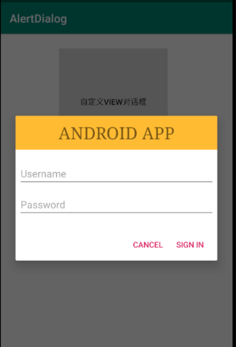
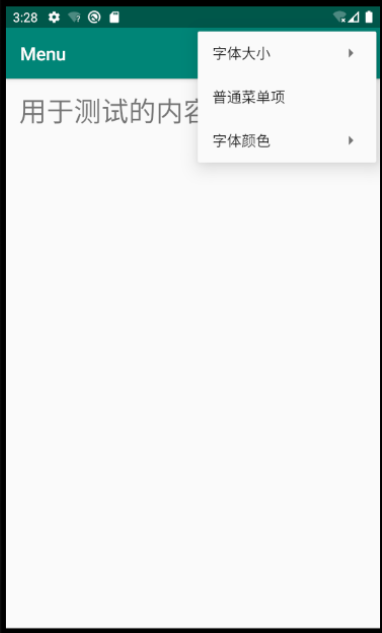
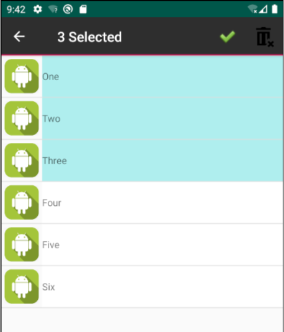

# Android UI组件

### 姓名：蔡洪                      学号：116072017015           班级：软工闽台  

### 1.Android ListView的用法

##### 布局文件中加入 ListView：

##### 这里将宽度和高度都设置为 match_parent，这样 ListView 就会占据了整个布局的空间。

##### activity_main.xml :

```
<?xml version="1.0" encoding="utf-8"?>
<LinearLayout xmlns:android="http://schemas.android.com/apk/res/android"    android:orientation="horizontal"    
android:layout_width="match_parent"   
android:layout_height="match_parent">   
<ListView android:id="@+id/mylist"      
android:layout_width="match_parent"      
android:layout_height="match_parent">
</ListView></LinearLayout>
```

##### 自定义的布局:

##### simpleadapter.xml :

```
<?xml version="1.0" encoding="utf-8"?>
<LinearLayout xmlns:android="http://schemas.android.com/apk/res/android"
    android:orientation="horizontal" android:layout_width="match_parent"
    android:layout_height="match_parent">

<TextView android:id="@+id/name"
        android:layout_width="wrap_content"
        android:layout_height="wrap_content"
        android:layout_weight="1"
        android:paddingLeft="10dp"
        android:textSize="20sp"/>

 <ImageView android:id="@+id/header"
        android:layout_width="50dp"
        android:layout_height="50dp"
        android:layout_gravity="right"
        android:paddingRight="10dp"/>

</LinearLayout>

```

##### MainActivity.java:

```
package com.example.simpleadapter;
import androidx.appcompat.app.AppCompatActivity;
import android.os.Bundle;
import android.util.Log;
import android.view.View;
import android.widget.AdapterView;
import android.widget.ListView;
import android.widget.SimpleAdapter;
import android.widget.Toast;
import java.util.ArrayList;
import java.util.HashMap;
import java.util.List;
import java.util.Map;
public class MainActivity extends AppCompatActivity {
    private String[] names = new String[]
            {"Lion","Tiger","Monkey","Dog","Cat","Elephant"};
    private int[] ImageIds = new int[]{R.drawable.lion,R.drawable.tiger,
            R.drawable.monkey, R.drawable.dog,R.drawable.cat,R.drawable.elephant};
    @Override
    protected void onCreate(Bundle savedInstanceState) {
        super.onCreate(savedInstanceState);
        setContentView(R.layout.activity_main);
        List<Map<String,Object>> listItems = new ArrayList<>();
        for (int i=0;i<names.length;i++)
        {
            Map<String, Object> listItem = new HashMap<>();
            listItem.put("name",names[i]);
            listItem.put("header",ImageIds[i]);
            listItems.add(listItem);
        }
        SimpleAdapter simpleAdapter = new SimpleAdapter(this,listItems,R.layout.simpleadapter,
                new String[]{"name","header"},new int[]{R.id.name,R.id.header});
        ListView list = findViewById(R.id.mylist);
        list.setAdapter(simpleAdapter);
        list.setOnItemClickListener(new AdapterView.OnItemClickListener()
        {
            @Override
            public void onItemClick(AdapterView<?> parent, View view, int position, long id) {
                System.out.println(names[position] + "被单击");
            }
        });
        list.setOnItemSelectedListener(new AdapterView.OnItemSelectedListener()
        {
            @Override
            public void onItemSelected(AdapterView<?> parent, View view, int position, long id)
            {
                Toast toast = Toast.makeText(MainActivity.this, names[position], Toast.LENGTH_SHORT);
                toast.show();
            }
            @Override
            public void onNothingSelected(AdapterView<?> parent)
            {
            }
        });
    }
}
```

#### 项目结果：


### 2.创建自定义布局的AlertDialog

#### 代码：

##### activity_main.xml

##### 这里将宽度和高度都设置为 match_parent，这样 ListView 就会占据了整个布局的空间

```
<?xml version="1.0" encoding="utf-8"?>
<LinearLayout xmlns:android="http://schemas.android.com/apk/res/android"
    android:layout_width="match_parent"
    android:layout_height="match_parent"
    android:orientation="vertical">
    <Button
        android:layout_width="200dp"
        android:layout_height="200dp"
        android:onClick="customView"
        android:text="@string/view"
        android:layout_marginTop="20dp"
        android:layout_marginLeft="100dp"
        android:layout_marginBottom="50dp"/>
    <TextView
        android:id="@+id/show"
        android:layout_width="match_parent"
        android:layout_height="wrap_content"
        android:textSize="35dp"
        android:inputType="text" />

</LinearLayout>
```

##### login.xml

```
<?xml version="1.0" encoding="utf-8"?>
<LinearLayout xmlns:android="http://schemas.android.com/apk/res/android"
    android:layout_width="match_parent"
    android:layout_height="match_parent"
    android:orientation="vertical">

    <TextView
        android:layout_width="match_parent"
        android:layout_height="60dp"
        android:textSize="30sp"
        android:text="@string/android_app"
        android:gravity="center"
        android:typeface="serif"
        android:background="#FFFFBB33"
        />

    <EditText
        android:id="@+id/username"
        android:layout_width="match_parent"
        android:layout_height="wrap_content"
        android:hint="@string/username"
        android:selectAllOnFocus="true"
        android:layout_marginTop="20dp"
        android:layout_marginLeft="5dp"
        android:layout_marginRight="5dp"
        android:layout_marginBottom="5dp" />

    <EditText
        android:id="@+id/password"
        android:layout_width="match_parent"
        android:layout_height="wrap_content"
        android:hint="@string/password"
        android:inputType="textPassword"
        android:layout_marginTop="5dp"
        android:layout_marginLeft="5dp"
        android:layout_marginRight="5dp"
        android:layout_marginBottom="20dp" />

</LinearLayout>
```

##### strings.xml

```
<resources>
    <string name="app_name">AlertDialog</string>
    <string name="android_app">ANDROID APP</string>
    <string name="password">Password</string>
    <string name="username">Username</string>
    <string name="view">自定义View对话框</string>
</resources>
```

##### MainActivity.java

```
package com.example.alertdialog;

import androidx.appcompat.app.AppCompatActivity;
import android.os.Bundle;
import android.app.AlertDialog;
import android.view.View;
import android.widget.LinearLayout;
import android.widget.TextView;

public class MainActivity extends AppCompatActivity {
    private TextView show;
    @Override
    protected void onCreate(Bundle savedInstanceState) {
        super.onCreate(savedInstanceState);
        setContentView(R.layout.activity_main);
        show = findViewById(R.id.show);
    }
    private AlertDialog.Builder setPositiveButton(AlertDialog.Builder builder)
    {
        return builder.setPositiveButton("Sign in", (dialog, which) -> show.setText("Sign in ！"));
    }
    private AlertDialog.Builder setNegativeButton(AlertDialog.Builder builder)
    {
        return builder.setNegativeButton("Cancel", (dialog, which) -> show.setText("Cancel ！"));
    }
    public void customView(View source)
    {
        LinearLayout loginForm = (LinearLayout) getLayoutInflater().inflate(R.layout.login, null);
        AlertDialog.Builder builder = new AlertDialog.Builder(this).setView(loginForm);
        setPositiveButton(builder);
        setNegativeButton(builder).create().show();
    }
}
```

#### 项目结果：



### 3.使用XML定义菜单

#### 代码：

**main.xml**

```
<?xml version="1.0" encoding="utf-8"?>
<LinearLayout xmlns:android="http://schemas.android.com/apk/res/android"
    android:layout_width="match_parent"
    android:layout_height="match_parent"
    android:orientation="vertical">
    <TextView
        android:id="@+id/txt"
        android:padding="15dp"
        android:layout_width="match_parent"
        android:layout_height="wrap_content"
        android:textSize="30sp"
        android:text="用于测试的内容" />
</LinearLayout>
```

**MainActivity.java**

```
package com.example.menu;

import androidx.appcompat.app.AppCompatActivity;
import android.os.Bundle;
import android.widget.TextView;
import android.graphics.Color;
import android.view.Menu;
import android.view.MenuItem;
import android.view.SubMenu;
import android.widget.Toast;

public class MainActivity extends AppCompatActivity {
    // 定义字体大小
    private static final int FONT_10 = 0x111;
    private static final int FONT_16 = 0x112;
    private static final int FONT_20 = 0x113;
    private static final int PLAIN_ITEM = 0x11b;
    // 定义字体颜色菜单项
    private static final int FONT_RED = 0x114;
    private static final int FONT_BLACK = 0x115;
    private TextView text;
    @Override
    protected void onCreate(Bundle savedInstanceState) {
        super.onCreate(savedInstanceState);
        setContentView(R.layout.main);
        text = findViewById(R.id.txt);
    }
    @Override 
    public boolean onCreateOptionsMenu(Menu menu)
    {
        SubMenu fontMenu = menu.addSubMenu("字体大小");
        fontMenu.setHeaderTitle("选择字体大小");
        fontMenu.add(0, FONT_10, 0, "10号字体");
        fontMenu.add(0, FONT_16, 0, "16号字体");
        fontMenu.add(0, FONT_20, 0, "20号字体");
        menu.add(0, PLAIN_ITEM, 0, "普通菜单项");
        SubMenu colorMenu = menu.addSubMenu("字体颜色");
        colorMenu.setHeaderTitle("选择文字颜色");
        colorMenu.add(0, FONT_RED, 0, "红色");
        colorMenu.add(0, FONT_BLACK, 0, "黑色");
        return super.onCreateOptionsMenu(menu);
    }
    @Override 
    public boolean onOptionsItemSelected(MenuItem mi)
    {
        switch (mi.getItemId())
        {
            case FONT_10: text.setTextSize(10 * 2);	break;
            case FONT_16: text.setTextSize(16 * 2); break;
            case FONT_20: text.setTextSize(20 * 2); break;
            case FONT_RED: text.setTextColor(Color.RED); break;
            case FONT_BLACK: text.setTextColor(Color.BLACK); break;
            case PLAIN_ITEM:
                Toast.makeText(MainActivity.this,
                        "您单击了普通菜单项", Toast.LENGTH_SHORT)
                        .show();
                break;
        }
        return true;
    }
}
```

#### 项目结果：



### 4.创建上下文操作模式(ActionMode)的上下文菜单

#### **（本题不大会使用了同学的代码）**

##### activity_main.xml

```
<?xml version="1.0" encoding="utf-8"?>
<LinearLayout
    xmlns:android="http://schemas.android.com/apk/res/android"
    android:layout_width="match_parent"
    android:layout_height="match_parent"
    android:orientation="vertical">

    <ListView
        android:id="@+id/list_view"
        android:layout_width="match_parent"
        android:layout_height="match_parent"
        android:choiceMode="multipleChoiceModal"/>
</LinearLayout>
```

##### activity_action_mode.xml

```
<?xml version="1.0" encoding="utf-8"?>
<menu xmlns:android="http://schemas.android.com/apk/res/android"
    xmlns:app="http://schemas.android.com/apk/res-auto">

    <item
        android:id="@+id/menu_all"
        app:showAsAction="always"
        android:icon="@drawable/select"
        android:title="item_all"/>

    <item
        android:id="@+id/menu_delete"
        app:showAsAction="always"
        android:icon="@drawable/dustbin"
        android:title="item_delete"/>
</menu>
```

##### activity_content.xml

```
<?xml version="1.0" encoding="utf-8"?>
<LinearLayout
    xmlns:android="http://schemas.android.com/apk/res/android"
    android:layout_width="match_parent"
    android:layout_height="wrap_content">
    <ImageView
        android:id="@+id/image"
        android:layout_width="50dp"
        android:layout_height="50dp"
        android:layout_margin="5dp"
        android:src="@drawable/robot" />

    <TextView
        android:id="@+id/text_view"
        android:layout_width="match_parent"
        android:layout_height="60dp"
        android:gravity="center_vertical" />

</LinearLayout>
```

##### MainActivity.java

```
package com.example.contextmenu;

import androidx.appcompat.app.AppCompatActivity;
import android.os.Bundle;
import android.view.ActionMode;
import android.view.Menu;
import android.view.MenuInflater;
import android.view.MenuItem;
import android.widget.AbsListView;
import android.widget.BaseAdapter;
import android.widget.ListView;
import java.util.ArrayList;
import java.util.List;

public class MainActivity extends AppCompatActivity {

    private ListView listView;
    private List<Item> list;

    private BaseAdapter adapter;
    private String [] name = {"One","Two","Three","Four","Five","Six"};

    @Override
    protected void onCreate(Bundle savedInstanceState) {
        super.onCreate(savedInstanceState);
        setContentView(R.layout.activity_main);

        listView = findViewById(R.id.list_view);
        list = new ArrayList<Item>();
        for(int i = 0; i < 6; i++){
            list.add(new Item(name[i], false));
        }
        adapter = new AdapterCur(list,MainActivity.this);
        listView.setAdapter(adapter);

        listView.setChoiceMode(ListView.CHOICE_MODE_MULTIPLE_MODAL);
        listView.setMultiChoiceModeListener(new AbsListView.MultiChoiceModeListener() {
            int num = 0;

            @Override
            public void onItemCheckedStateChanged(ActionMode mode, int position, long id, boolean checked) {

                if (checked == true) {
                    list.get(position).setBo(true);
                    adapter.notifyDataSetChanged();
                    num++;
                } else {
                    list.get(position).setBo(false);
                    adapter.notifyDataSetChanged();
                    num--;
                }
                mode.setTitle("  " + num + " Selected");
            }

            @Override
            public boolean onCreateActionMode(ActionMode mode, Menu menu) {
                MenuInflater inflater = mode.getMenuInflater();
                inflater.inflate(R.menu.activity_action_mode, menu);
                num = 0;
                adapter.notifyDataSetChanged();
                return true;
            }

            @Override
            public boolean onPrepareActionMode(ActionMode mode, Menu menu) {

                adapter.notifyDataSetChanged();
                return false;
            }

            public void refresh(){
                for(int i = 0; i < 6; i++){
                    list.get(i).setBo(false);
                }
            }

            @Override
            public boolean onActionItemClicked(ActionMode mode, MenuItem item) {
                switch (item.getItemId()) {
                    case R.id.menu_all:
                        num = 0;
                        refresh();
                        adapter.notifyDataSetChanged();
                        mode.finish();
                        return true;
                    case R.id.menu_delete:
                        adapter.notifyDataSetChanged();
                        num = 0;
                        refresh();
                        mode.finish();
                        return true;
                    default:
                        refresh();
                        adapter.notifyDataSetChanged();
                        num = 0;
                        return false;
                }

            }

            @Override
            public void onDestroyActionMode(ActionMode mode) {
                refresh();
                adapter.notifyDataSetChanged();
            }

        });
    }
}
```

##### Item.java

```
package com.example.contextmenu;

public class Item {
    private String name;
    private boolean bo;

    public Item(String name, boolean bo){
        super();
        this.name = name;
        this.bo = bo;
    }
    public String getName() {
        return name;
    }

    public boolean isBo() {
        return bo;
    }
    public void setBo(boolean bo) {
        this.bo = bo;
    }
    @Override
    public String toString() {
        return "Item{" + "name='" + name + '\'' + ",bo=" + bo + '}';
    }
}
```

##### AdapterCur.java

```
package com.example.contextmenu;

import android.content.Context;
import android.graphics.Color;
import android.view.View;
import android.view.ViewGroup;
import android.widget.BaseAdapter;
import android.widget.ImageView;
import android.widget.TextView;
import java.util.List;

public class AdapterCur extends BaseAdapter {

    List<Item> list;
    Context context;

    public AdapterCur(List<Item> list, Context context) {
        this.context = context;
        this.list = list;
        notifyDataSetChanged();
    }

    public int getCount() {
        return list.size();
    }

    public Item getItem(int position) {
        return list.get(position);
    }

    public long getItemId(int position) {
        return 0;
    }

    public View getView(final int position, View convertView, ViewGroup parent) {

        final ViewHolder viewHolder;
        if(convertView==null){
            convertView=View.inflate(context, R.layout.activity_content, null);
            viewHolder=new ViewHolder();
            viewHolder.imageView = convertView.findViewById(R.id.image);
            viewHolder.textView = convertView.findViewById(R.id.text_view);
            convertView.setTag(viewHolder);
        }else{
            viewHolder=(ViewHolder) convertView.getTag();
        }

        int PaleTurquoise = Color.parseColor("#AFEEEE");
        int white = Color.parseColor("#FFFFFF");
        viewHolder.textView.setText(list.get(position).getName());
        if(list.get(position).isBo() == true){
            viewHolder.textView.setBackgroundColor(PaleTurquoise);
            viewHolder.imageView.setBackgroundColor(PaleTurquoise);
        }
        else {
            viewHolder.textView.setBackgroundColor(white);
            viewHolder.imageView.setBackgroundColor(white);
        }
        return convertView;
    }
    class ViewHolder{
        ImageView imageView;
        TextView textView;
    }
}
```

#### 项目结果：



