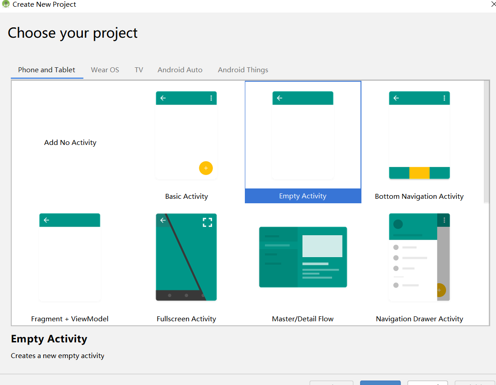
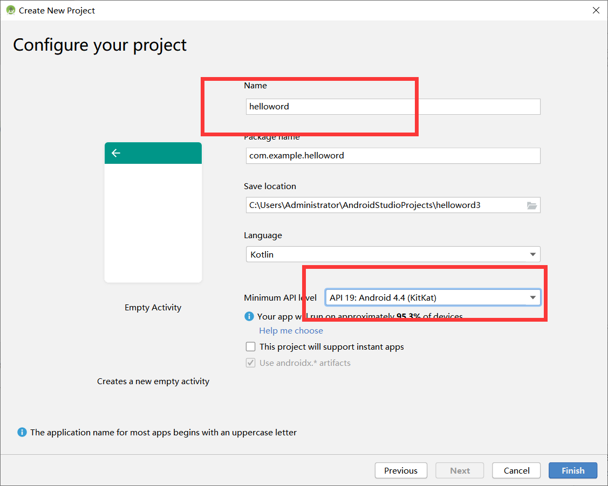
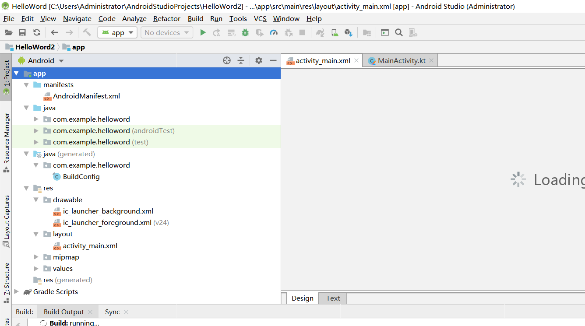
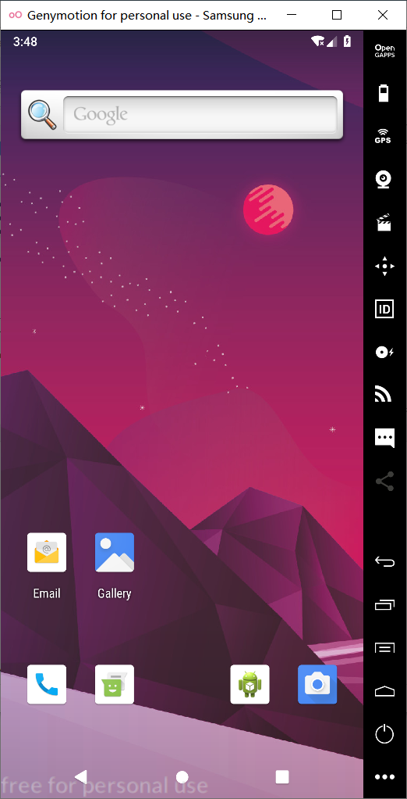
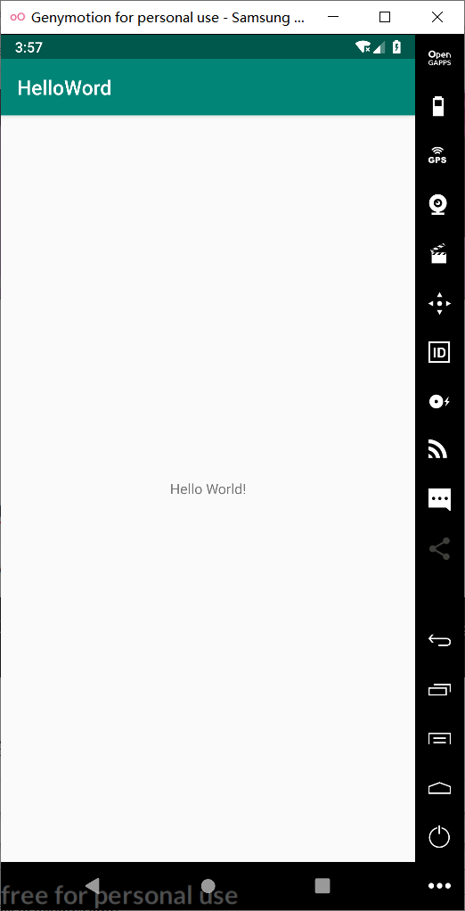
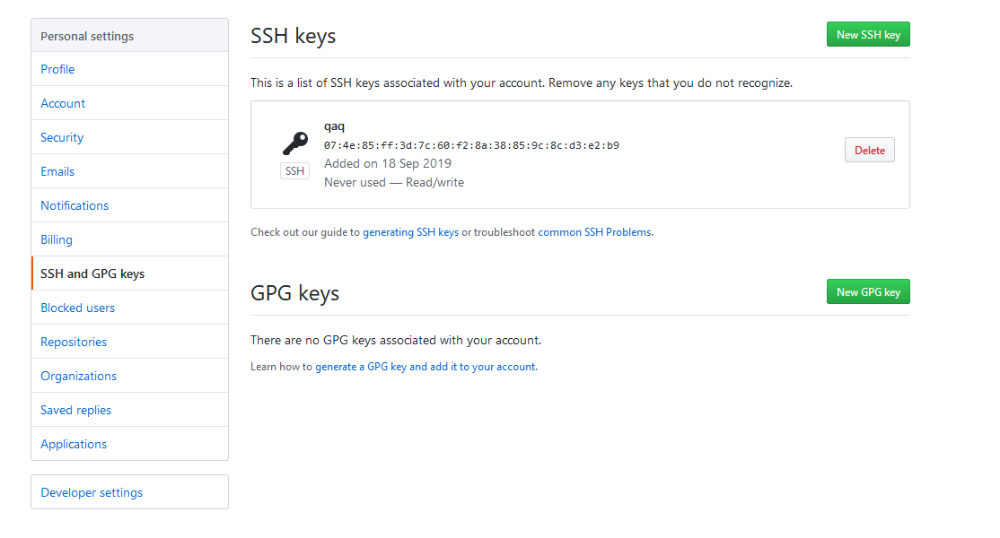
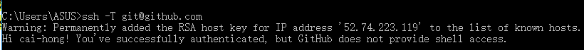
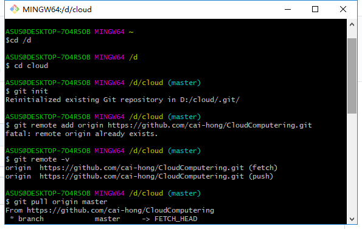
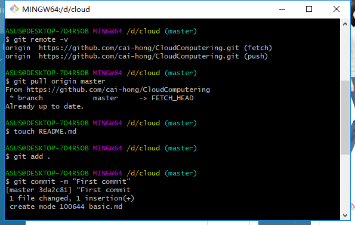
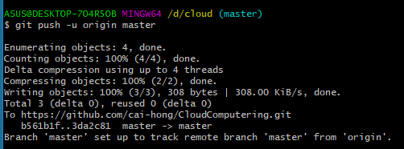

###   姓名：蔡洪                      学号：116072017015        班级：软工闽台      

### **1.安装**Android Studio

注意事项：一般默认版本是3.5，但是对于电脑硬件系统要求很高，至少4G以上内存。如果硬件达不到要求，可以选择早前的几个版本， 比如安装3.0版本或者更早的版本

安装好后创建helloword工程

打开如下：

打开模拟器：

运行：

## 2.在GitHub上创建云计算项目并在 本地同步

  创建新的ssh key

复制“id_rsa.pub”的内容到GitHub网站的Settings–>SSH and GPG keys中

测试SSH Key是否配置成功

配置用户名和邮箱

1.初始化本地文件夹作为一个Git仓库：

2.拷贝GitHub网站中的项目网址

3.添加远程代码仓库的URL

4.从远程代码仓库拉取数据

5.新建README文档，README文档是每个GitHub项目必备，说明项目内容。上文没有创建，在此处完成

6.添加文件夹中的所有文件

7.提交文件

8.推送本地更新至远程服务

