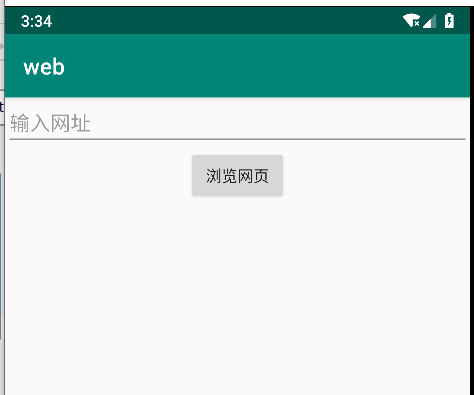
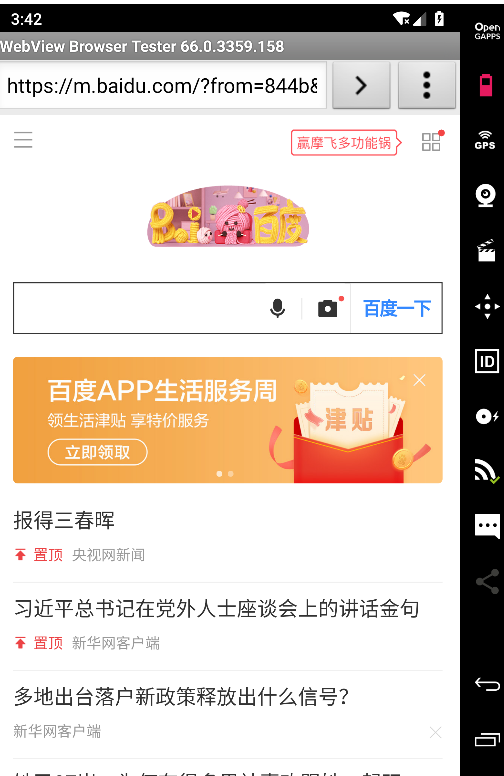
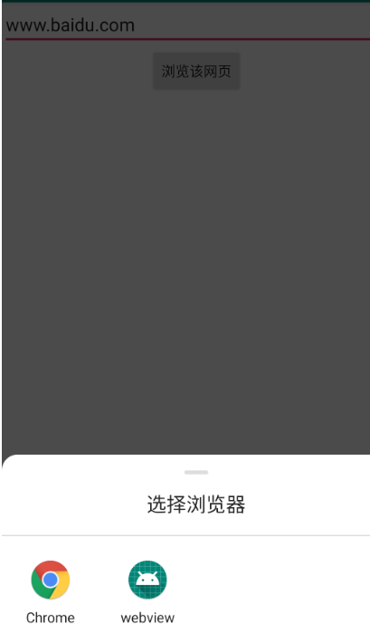
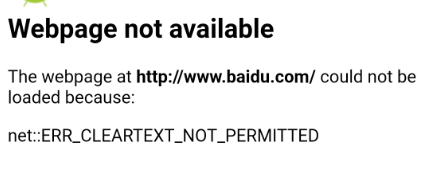
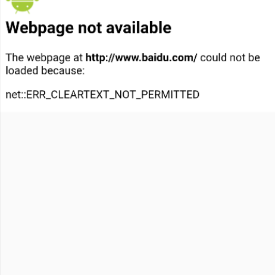

# **Intent**

### 姓名：蔡洪                      学号：116072017015           班级：软工闽台  

#### 本实验通过自定义 WebViewWebView WebView 加载 URL 来验证隐式 Intent Intent 的使用。

#### **实验包含两个应用：**

#### **1.获取 URL 地址并启动隐式 Intent 的调用。**
#### **2.自定义 WebViewWebView WebView 来加载 URL**

## 1.新建一个工程获取URL并启动intent

#### 输入URL网址，点击按钮，将发起浏览网页的行为

activity_layout.xml

```
<?xml version="1.0" encoding="utf-8"?>
<LinearLayout xmlns:android="http://schemas.android.com/apk/res/android"
    xmlns:tools="http://schemas.android.com/tools"
    android:orientation="vertical"
    android:layout_width="match_parent"
    android:layout_height="match_parent"
    android:gravity="center_horizontal">
    <EditText
        android:layout_width="match_parent"
        android:layout_height="wrap_content"
        android:id="@+id/input"
        android:hint="@string/web_url"
        android:textSize="30sp"
        android:autofillHints=""
        tools:ignore="TextFields" />

    <Button
        android:id="@+id/button"
        android:layout_width="wrap_content"
        android:layout_height="wrap_content"
        android:text="浏览网页"
        android:background="@color/colorPrimary"
        android:layout_gravity="center"
        android:textSize="30sp"
        android:gravity="center" />

</LinearLayout>
```

mainactivity.java

```
package com.example.webview1;
import androidx.appcompat.app.AppCompatActivity;
import android.content.Intent;
import android.net.Uri;
import android.os.Bundle;
import android.view.View;
import android.widget.Button;
import android.widget.EditText;
import android.widget.TextView;
import org.w3c.dom.Text;
public class MainActivity extends AppCompatActivity {
    EditText editText;
    Button button;
    @Override
    protected void onCreate(Bundle savedInstanceState) {
        super.onCreate(savedInstanceState);
        setContentView(R.layout.activity_main);
        button =(Button) findViewById(R.id.button);
        editText  =(EditText)findViewById(R.id.input);
        button.setOnClickListener(new View.OnClickListener() {
            @Override
            public void onClick(View v) {
                Intent intent = new Intent();
                String uri="";
                intent.setAction(Intent.ACTION_VIEW);
                uri=button.getText().toString();
                intent.setData(Uri.parse(uri));
                startActivity(intent);
            }
        });

    }


}
```






## 2.**新建一个工程使用WebView来加载URL**

#### 跳转之后，出现选择项，选择自定义的MyBrowser进行浏览

activity.mxl

```
<?xml version="1.0" encoding="utf-8"?>
<LinearLayout xmlns:android="http://schemas.android.com/apk/res/android"
    android:orientation="vertical"
    android:layout_width="match_parent"
    android:layout_height="match_parent"
    android:gravity="center_horizontal">
    <EditText
        android:layout_width="match_parent"
        android:layout_height="wrap_content"
        android:id="@+id/urlinput"
        android:hint="@string/web_url"
        android:textSize="30sp"
        android:autofillHints="" />

    <Button
        android:id="@+id/button"
        android:layout_width="wrap_content"
        android:layout_height="wrap_content"
        android:text="浏览该网页"
        android:textSize="30sp"
        android:background="@color/colorPrimary"
        android:layout_gravity="center"
        android:gravity="center" />
    <WebView
        android:layout_width="wrap_content"
        android:id="@+id/web"
        android:layout_height="wrap_content">
    </WebView>

</LinearLayout>
```

mainactivity.java

```
package com.example.myweb;
import androidx.appcompat.app.AppCompatActivity;
import android.os.Bundle;
import androidx.appcompat.app.AppCompatActivity;
import android.content.Intent;
import android.net.Uri;
import android.os.Bundle;
import android.view.View;
import android.webkit.WebView;
import android.webkit.WebViewClient;
import android.widget.Button;
import android.widget.EditText;

import java.net.URL;

public class MainActivity extends AppCompatActivity {
    EditText editText;
    Button button;
    @Override
    protected  void onCreate(Bundle savedInstanceState){
        super.onCreate(savedInstanceState);
        setContentView(R.layout.activity_main);
        button=findViewById(R.id.button);
        editText  =(EditText)findViewById(R.id.urlinput);
        button.setOnClickListener(new View.OnClickListener() {
            @Override
            public void onClick(View v) {
                Intent intent = new Intent();
                String uri="";
                uri=editText.getText().toString();
                intent.setData(Uri.parse(uri));
                intent.setAction(Intent.ACTION_VIEW);
                startActivity(intent);
            }
        });

        Intent intent=getIntent();
        Uri data = intent.getData();
        URL url=null;
        try{
            url=new URL(data.getScheme(),data.getHost(),data.getPath());
            startBroswer(url);
        }
        catch (Exception e){
            e.printStackTrace();
        }

    }
    private void startBroswer(URL url){
        WebView web=findViewById(R.id.web);
        web.loadUrl(url.toString());
        web.setWebViewClient(new WebViewClient(){
            @Override
            public boolean shouldOverrideUrlLoading(WebView v,String url){
                v.loadUrl(url);
                return true;
            }
        });
    }
}
```

### 选择webview：



### 无法显示：

### 不允许明文的HTTP



### 方法：

##### 1.在androidmainfest.xml文件里加入

**android:usesCleartextTraffic="true"**

##### 依旧未解决？？？？

