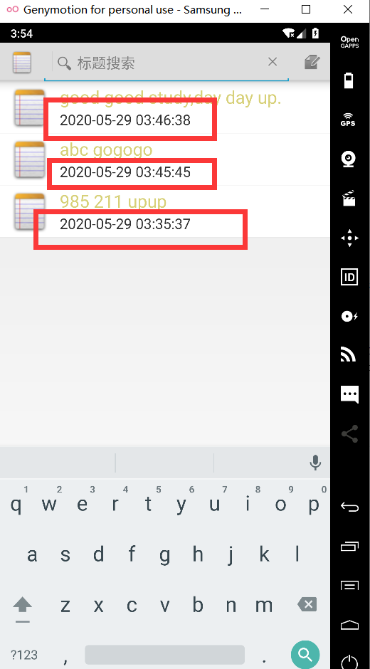
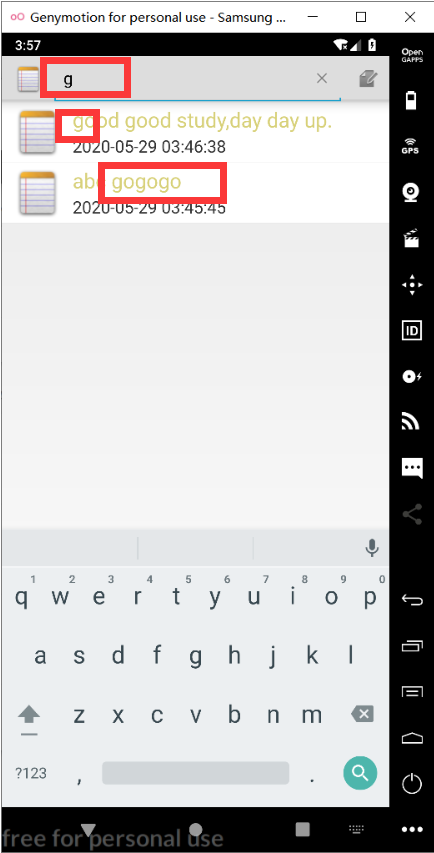
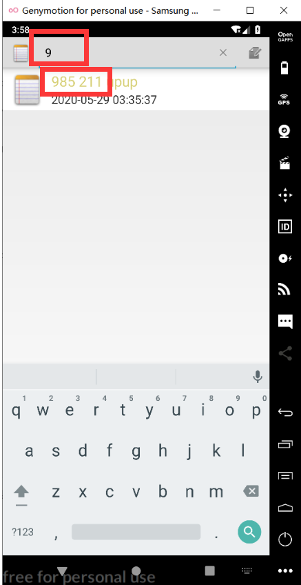

## Android期中实验 ——Notepad

实现以下两个功能：

**1.实现时间戳**

**2.实现查询的功能**

**先是采用了Android Sample--NotePad的代码**

**文章参考：[NotePad解析](https://blog.csdn.net/llfjfz/article/details/67638499)**

Notepad中一共包含了6个类，其中4个Activity，一个ContentProvider，还有一个数据契约类。

1.NotesList 应用程序的入口，笔记本的首页面会显示笔记的列表
2.NoteEditor 编辑笔记内容的Activity
3.TitleEditor 编辑笔记标题的Activity
4.NotesLiveFolder ContentProvider的LiveFolder（实时文件夹），这个功能在Android API 14后被废弃，不再支5.持。因此代码中所有涉及LiveFolder的内容将不再阐述。
6.NotePadProvider 这是笔记本应用的ContentProvider，也是整个应用的关键所在


#### **1.实现时间戳**

**我先是在网上查找了修改方法**

**文章参考：[Android studio时间戳的实现](https://blog.csdn.net/weixin_42490080/article/details/90609600)**

在基本的框架下，举出

其中两个比较特殊的修改：

**COLUMN_NAME_CREATE_DATE：**

public void onCreate(SQLiteDatabase db) {
db.execSQL(“CREATE TABLE " + NotePad.Notes.TABLE_NAME + " (”

+NotePad.Notes._ID + " INTEGER PRIMARY KEY,"

+NotePad.Notes.COLUMN_NAME_TITLE + " TEXT,"

+NotePad.Notes.COLUMN_NAME_NOTE + " TEXT,"

+NotePad.Notes.COLUMN_NAME_CREATE_DATE + " INTEGER,"

+NotePad.Notes.COLUMN_NAME_MODIFICATION_DATE + " INTEGER"

+“);”);
}

**创建和修改的时候对数据库中的时间进行相应的显示：**

Long now = Long.valueOf(System.currentTimeMillis());

if (values.containsKey(NotePad.Notes.COLUMN_NAME_CREATE_DATE) == false) {
values.put(NotePad.Notes.COLUMN_NAME_CREATE_DATE, now);
}
// If the values map doesn’t contain the modification date, sets the value to the current time.
if (values.containsKey(NotePad.Notes.COLUMN_NAME_MODIFICATION_DATE) == false) {
values.put(NotePad.Notes.COLUMN_NAME_MODIFICATION_DATE, now);
}

**但是一直报错，不会修改，所以放弃该方法。**

采取了以下方法：

**（1）先修改noteslist_item.xml添加TextView**

```
 <TextView xmlns:android="http://schemas.android.com/apk/res/android"
            android:id="@+id/time1"
            android:layout_width="match_parent"
            android:paddingLeft="10dp"
            android:layout_height="20dp"
            android:textSize="18dp"
            />       
```

**（2）updateNote函数，添加时间参数，并将时间插入values**

`values.put(NotePad.Notes.COLUMN_NAME_MODIFICATION_DATE, getFormatData());` 

**（3）getFormatData函数为自定义添加的一个以String函数，获取当前时间的函数**

```
public String getFormatData(){
    long time=System.currentTimeMillis();
    android.os.SystemClock.uptimeMillis();
    SimpleDateFormat format=new SimpleDateFormat("yyyy-MM-dd HH:mm:ss");
    Date mdata=new Date(time);
    String mtime=format.format(mdata);
    return mtime;
}
```

**（4）修改PROJECTION添加COLUMN_NAME_MODIFICATION_DATE对象**

```
private static final String[] PROJECTION = new String[] {
            NotePad.Notes._ID, // 0
            NotePad.Notes.COLUMN_NAME_TITLE, // 1
            NotePad.Notes.COLUMN_NAME_MODIFICATION_DATE, 
    };
```

**（5）NotesList中的onCreate函数读取数据时增加获取时间属性，把时间值放到新添的textview中：**

        private static final String[] PROJECTION = new String[] {
                NotePad.Notes._ID, // 0
                NotePad.Notes.COLUMN_NAME_TITLE, // 1
                NotePad.Notes.COLUMN_NAME_MODIFICATION_DATE, 
        };
           protected void onCreate(Bundle savedInstanceState) {
            super.onCreate(savedInstanceState);
            setDefaultKeyMode(DEFAULT_KEYS_SHORTCUT);
            Intent intent = getIntent();
            if (intent.getData() == null) {
                intent.setData(NotePad.Notes.CONTENT_URI);
            }
        getListView().setOnCreateContextMenuListener(this);
    
        Cursor cursor = managedQuery(
            getIntent().getData(),            // Use the default content URI for the provider.
            PROJECTION,                       // Return the note ID and title for each note.
            null,                             // No where clause, return all records.
            null,                             // No where clause, therefore no where column values.
            NotePad.Notes.DEFAULT_SORT_ORDER  // Use the default sort order.
        );
    
    String[] dataColumns = { NotePad.Notes.COLUMN_NAME_TITLE,NotePad.Notes.COLUMN_NAME_MODIFICATION_DATE } ;    
        int[] viewIDs = { android.R.id.text1, R.id.time1 };
        //修改dataColumns和viewIDs 
        // Creates the backing adapter for the ListView.
        adapter = new SimpleCursorAdapter(
                      this,                             // The Context for the ListView
                      R.layout.noteslist_item,          // Points to the XML for a list item
                      cursor,                           // The cursor to get items from
                      dataColumns,
                      viewIDs
              );
        //将dataColumns和viewIDs参数传给adapter
        // Sets the ListView's adapter to be the cursor adapter that was just created.
        setListAdapter(adapter);
    }
#### 结果：



#### 2.实现查询的功能

**同样的，我在网上查找了searchView的用法，都是将它在layout中修改的，与sample不符合，不知道怎么在里面添加searchView**

**所以我选择了在NotesList页面获取搜索关键词然后在查询时使用sql 的like添加查询条件**

```
public boolean onCreateOptionsMenu(Menu menu) {
        // Inflate menu from XML resource
        MenuInflater inflater = getMenuInflater();
        inflater.inflate(R.menu.list_options_menu, menu);  
        MenuItem searchItem = menu.findItem(R.id.action_search);
        SearchView mSearchView = (SearchView) searchItem.getActionView();
        mSearchView.setSubmitButtonEnabled(false);     
        mSearchView.setQueryHint("搜索");                                   
        mSearchView.setOnCloseListener(new SearchView.OnCloseListener() {
            @Override
            public boolean onClose() {
            //    Toast.makeText(NextActivity.this, "Close", Toast.LENGTH_SHORT).show();
                return false;
            }
        });
        mSearchView.setOnSearchClickListener(new View.OnClickListener() {
            @Override
            public void onClick(View v) {
             //   Toast.makeText(NextActivity.this, "Open", Toast.LENGTH_SHORT).show();
            }
        });
        mSearchView.setOnQueryTextListener(new SearchView.OnQueryTextListener() {
            @Override
            public boolean onQueryTextSubmit(String s) {
             //   Log.d(TAG, "TextSubmit : " + s);
            //    LogUtil.e(NextActivity.class, "TextSubmit : " + s);
                return false;
            }

            @Override
            public boolean onQueryTextChange(String s) {
  /* Performs a managed query. The Activity handles closing and requerying the cursor
   * when needed.
   *
   * Please see the introductory note about performing provider operations on the UI thread.
   */
  String mslection = new String (NotePad.Notes.COLUMN_NAME_TITLE+" LIKE '%"+s+"%'"  );
                String[] mArgs = new String[] {  s  };
                Cursor cursor = managedQuery(
                        getIntent().getData(),            
                        // Use the default content URI for the provider.
                        PROJECTION,                      
                        // Return the note ID and title for each note.
                        mslection,                            
                        // No where clause, return all records.
                        null,                             
                        // No where clause, therefore no where column values.
                        NotePad.Notes.DEFAULT_SORT_ORDER  
                        // Use the default sort order.
                );
                Log.e(TAG, "查询 --> " + cursor.getCount());

/*
 * The following two arrays create a "map" between columns in the cursor and view IDs
 * for items in the ListView. Each element in the dataColumns array represents
 * a column name; each element in the viewID array represents the ID of a View.
 * The SimpleCursorAdapter maps them in ascending order to determine where each column
 * value will appear in the ListView.
 */

// The names of the cursor columns to display in the view, initialized to the title column
                String[] dataColumns = { NotePad.Notes.COLUMN_NAME_TITLE , NotePad.Notes.COLUMN_NAME_MODIFICATION_DATE } ;

 // The view IDs that will display the cursor columns, initialized to the TextView in
 // noteslist_item.xml
                int[] viewIDs = { android.R.id.text1, R.id.time1 };

 // Creates the backing adapter for the ListView.
                adapter.changeCursor(cursor);

 // Sets the ListView's adapter to be the cursor adapter that was just created.
                setListAdapter(adapter);
                Log.d(TAG, "TextChange --> " + s);
 //   LogUtil.e(NextActivity.class, "TextChange --> " + s);
                return false;
            }
        });
 // Generate any additional actions that can be performed on the
 // overall list.  In a normal install, there are no additional
 // actions found here, but this allows other applications to extend
 // our menu with their own actions.
        Intent intent = new Intent(null, getIntent().getData());
        intent.addCategory(Intent.CATEGORY_ALTERNATIVE);
        menu.addIntentOptions(Menu.CATEGORY_ALTERNATIVE, 0, 0,
                new ComponentName(this, NotesList.class), null, intent, 0, null);
        return super.onCreateOptionsMenu(menu);
    }
```

#### **结果：**



